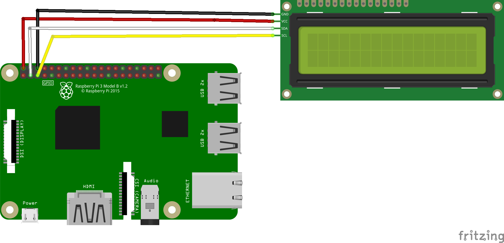

# ProtoStax_RPi_LCD_Example
ProtoStax Raspberry Pi LCD Example


using
[ProtoStax for Raspberry Pi B+](https://www.protostax.com/products/protostax-for-raspberry-pi-b)
and
[ProtoStax LCD Kit V2](https://www.protostax.com/collections/all/products/protostax-lcd-kit-v2)


For the full project writeup, see 
[ProtoStax Raspberry Pi Enclosure with I2C LCD Display](https://www.hackster.io/protostax-team/protostax-raspberry-pi-enclosure-with-i2c-lcd-display-6d09a6)

## Prerequisites

Wire the Raspberry Pi to the LCD I2C module from the [ProtoStax LCD Kit V2](https://www.protostax.com/collections/all/products/protostax-lcd-kit-v2)
as shown




* Enable I2C on the Raspberry Pi
* Python 3 or higher. The code assumes you are using Python 3 or higher

**Install RPLCD, python-smbus**
**NOTE - Use sudo pip3!**

```
sudo pip3 install RPLCD 
sudo apt-get install python-smbus
```

## Installing

```
git clone https://github.com/protostax/ProtoStax_RPi_LCD_Example.git
```

## Usage

```
cd ProtoStax_RPi_LCD_Example
```

**NOTE - Using Python 3 or higher!**

```
python3 lcd_ip.py
```

The program will run every 10 seconds, updating the LCD
display with the current date and time, and IP address and hostname
(if connected to the network). If not connected, IP, hostname will be
empty, so it also indicates network connectivity.


## Running the script as a service

The Python script can be started during boot by creating a service - more info at https://www.raspberrypi.org/documentation/linux/usage/systemd.md

1. Edit lcd.service - adjust the **WorkingDirectory** path
according to where you've installed it:

```
WorkingDirectory=/home/pi/ProtoStax_RPi_LCD_Example
```

2. Copy the lcd.service file into /etc/systemd/system as root:

```
sudo cp lcd.service /etc/systemd/system/
```

3. Start the service:
```
sudo systemctl start lcd.service
```

4. Check if the service is running:

```
sudo systemctl status lcd.service
```

The output should be similar to:
```

● lcd.service - LCD IP Display
   Loaded: loaded (/etc/systemd/system/lcd.service; enabled; vendor preset: enab
   Active: active (running) since Tue 2021-12-28 15:32:40 PST; 3s ago
 Main PID: 16282 (python3)
    Tasks: 1 (limit: 1308)
   CGroup: /system.slice/lcd.service
           └─16282 /usr/bin/python3 lcd_ip.py

Dec 28 15:32:40 pi4 systemd[1]: Started LCD IP Display.

```

5. If the service is running fine, you can enable it and reboot the Raspberry Pi to load it automatically during boot:
```
sudo systemctl enable lcd.service
```

6. To stop the service:
```
sudo systemctl stop lcd.service
```


## License

Written by Sridhar Rajagopal for ProtoStax. BSD license, all text above must be included in any redistribution

A lot of time and effort has gone into providing this and other code. Please support ProtoStax by purchasing products from us!
